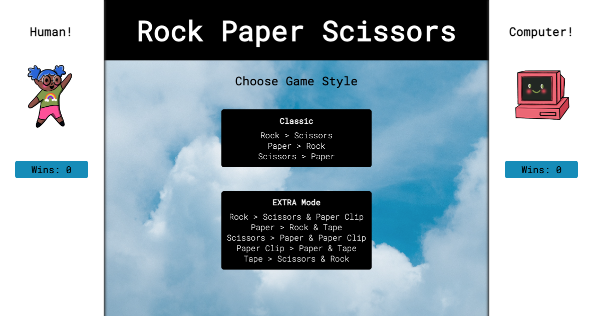
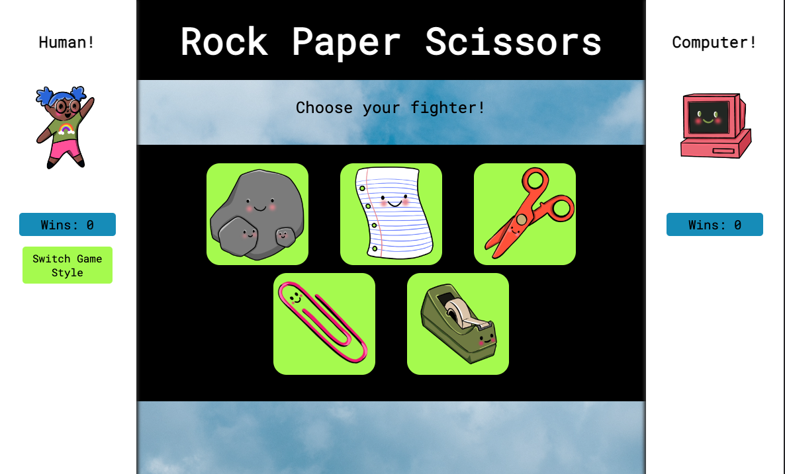
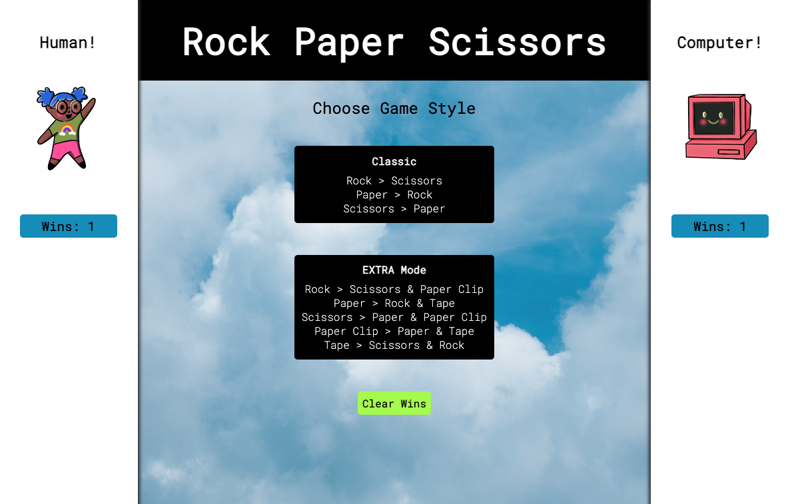

# Rock Paper Scissors
**[Link to Deployed Page](https://aspitz1.github.io/rock-paper-scissors/)**
## Introduction
Ahh the nostalgia of rock paper scissors. This game will give you just that! All
the fun of the OG game plus something a little EXTRA. EXTRA meaning a couple new
office supplies to add to the battle (a rock is a office supply!?). So go ahead
you're just a few clicks away from some childhood joy!
## Technologies
* JavaScript
* HTML
* CSS
## Features
When you land on the main page you will see a human player section on the left
and a computer player section on the right. The main part of the page will
display two options for game play. After choosing your gameplay option the HTML
will change to display the options for fighters as images. Click on your choice
and the HTML will immediately change to display the fighter choice of the
human and computer player, along with text to say who won. The game board will
automatically be redisplayed with the choice of fighters for another round. There
is a counter under each player token that keeps track of wins. If you would like
to go back to the main page to choose a different game style, do so by clicking
the button under the human token. This button is only available during the phase
of the game where fighters would be chosen.

  

  

  
This game of rock paper scissors is set up using two classes, a Player class and
a Game class. The fighters and players are dynamic and can be changed using
global variables in the main.js. If the Player instance is a human, a parameter
that is equal to the string `human` needs to be passed in to the player. Same is
for if the player should be the computer, pass in a `computer`. The game
currently has a method in the game class that runs the game between a human and
the computer. The game can not be currently run between two humans.
  
The Player class handles all the methods that directly change the values within
the Player. The Game class holds the data about the tokens, which tokens belong
to which game style and the rules for the game. The Game class also holds the
method that runs the human vs computer gameplay.
  
The main.js file pulls together the two classes to create the game as it is
displayed in the browser. The global variables are organized by alphabetical
order. The functions are organized by how they appear in the list of event
listeners. If a function is invoked in another function it will be directly
underneath the function it is called in.
  
The asset files should have naming conventions that match the values of the
fighters. They are interpolated into a file path in the main.js to
display the images.
  
The app utilizes local storage for saving the data of each player through a
refresh. There is a button provided on the main page to clear the storage when
there is data in the local storage.

  
This app is responsive and has css for phones, medium screens and large screens.
# Game Rules
If you are going to fork and clone this repo feel free to add your own Fighters!
Follow these rules when creating your fighter object.
## Classic
fighterOne > fighterThree
  
fighterTwo > fighterOne
  
fighterThree > fighterTwo
## EXTRA
fighterOne > fighterThree & fighterFour
  
fighterTwo > fighterOne & fighterFive
  
fighterThree > fighterTwo & fighterFour
  
fighterFour > fighterTwo & fighterFive
  
fighterFive > fighterThree & fighterOne

# Set Up
1. Fork this repo
2. Clone the repo to your local machine
3. In your terminal, navigate to your project repo
4. Run the command `open index.html`

## Project Spec & Ruberic
* The project spec & rubric can be found [here](https://frontend.turing.edu/projects/module-1/rock-paper-scissors-solo-v2.html)
